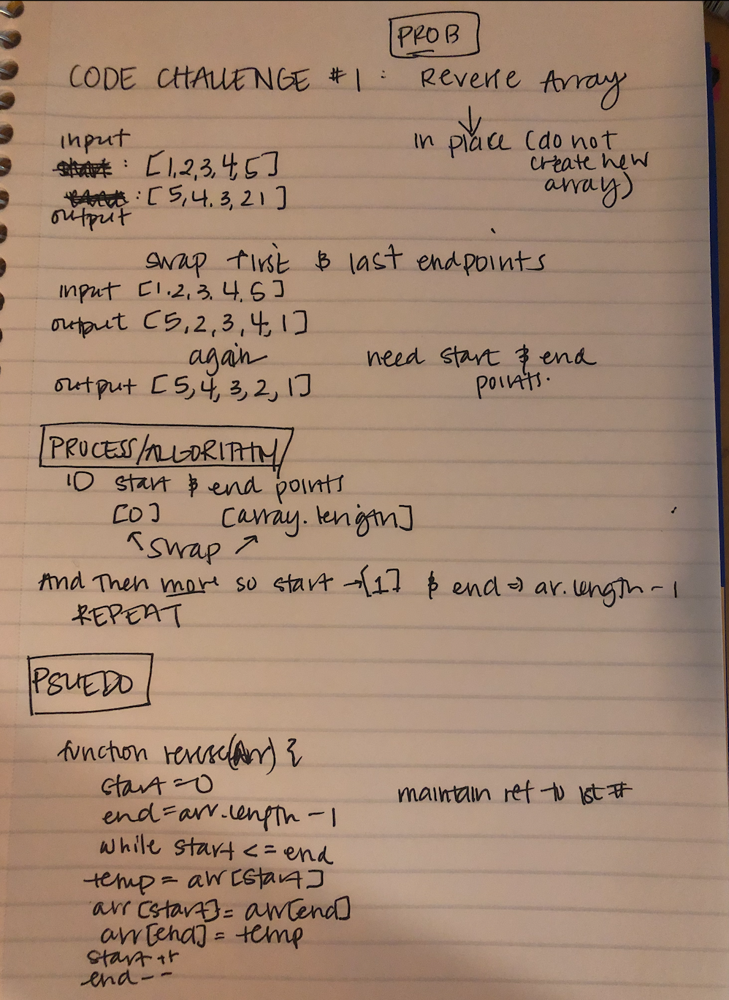

# Reverse an Array
Code Challenge 01: Reversing an array

## Challenge
<!-- Description of the challenge -->

## Approach & Efficiency
<!-- What approach did you take? Why? What is the Big O space/time for this approach? -->
- ID start and end of array (0 and length -1)
- Swap array[start] with array[end]
- Move start forward by 1 
- Move end backward by 1
- Repeat while start <= end

## Solution
