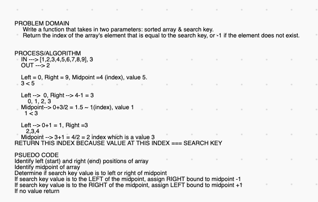

# Array Binary Search
Code Challenge 03

## Challenge
Write a function that takes in a sorted array and a search key.  Using a binary search algorithm, return the index of the search key.

## Approach & Efficiency
-Identify the start (left) and end (right) of the sorted array
-Left + Right/2 will get midpoint index
-If value at index midpoint is less than the search key, adjust the right bound to a value of midpoint -1
-If value at index midpoint is greater than the search key, adjust the left bound to a value of midpoint +1
-When value of midpoint === search key, return index number
-If search key DNE, return -1

## Solution
