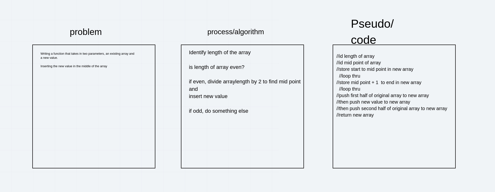

# Insert Shift Array
Code Challenge 02

## Challenge
Given an array with values, write a function that takes in the array and a value.  Insert the value in the middle of the array and return the array.  

## Approach & Efficiency
- ID length of array
- ID mid point of array (length/2)
- loop thru start of array to midpoint index
  - push values to NEW array
- push value to NEW array
- loop thru midpoint index +1 to end of array 
  - push values to NEW array
-return NEW array

## Solution

