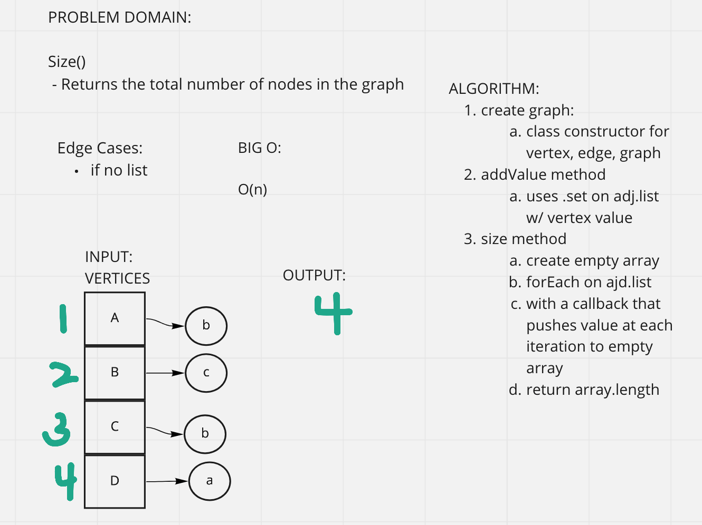

# Graph Implementation
Code Challenge 35

## Challenge
AddNode()
  - adds a new node to the graph
  - takes in the value of that node
  - returns the node

AddEdge()
  - Adds a new edge between two nodes in the graph
  - Include the ability to have a weight
  - Takes in the two nodes to be connected by the edge (both nodes should already be in the graph)

GetNodes()
  - returns all of the nodes in the graph as a collection

GetNeighbors()
  - Returns a collection of edges connected to the given node
  - Takes in a given node 
  - include the weight of the connection in the returned collection

Size()
  - Returns the total number of nodes in the graph

## Approach & Efficiency
  - Create class constructor to create Vertex, Edge. The Graph constructor will create an empty object and assign it to this.adjacencyList.
  - Because we are using map we can use .set and .get on this.adjencyList to add vertices and edges.
  - In size(), do a forEach on this.adjacencyList and push each node into an empty array to return.

## Solution

