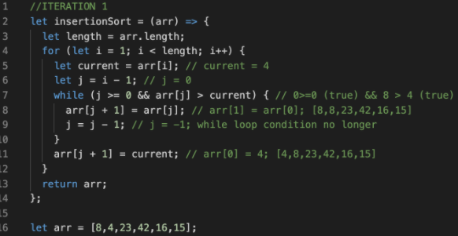
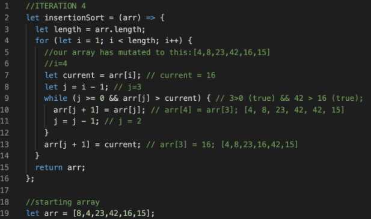
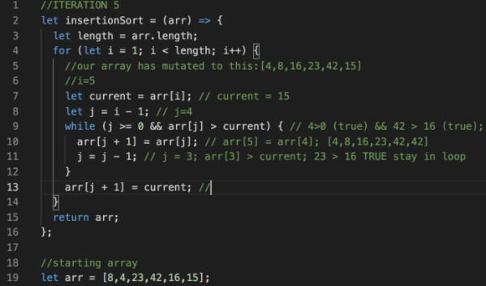
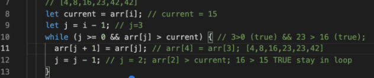
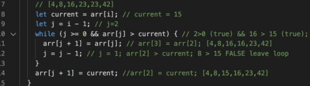

## Insertion Sort
This code is based on this article:
https://medium.com/javascript-algorithms/javascript-algorithms-insertion-sort-59b6b655373c 

An insertion sort method will take in an array of numbers for example [8,4,23,42,16,15] and return an array with the numbers in ascending order = [4,8,15,16,23,42].  This article will walk through what is being executed line by line in each iteration of the for loop with a nested while loop. 

In order for this sorting function to work, we will need to define storage variables that will allow us to compare values as we traverse the array.  I have defined these values as `let current` and `let j`.  Current holds a value and j holds an index number.  Subtracting or adding one to j let’s us access values to the left or right of our declared current as well as update those variables as we iterate over the array.

### 1st Iteration

Initialize for loop and iterates through the length of arr.  Begin iteration at index of 1.  Declare current and assign it the value of index of 1.  Declare j and assign it the value of index - 1.  We then use j and current to create conditions to enter the while loop.  In order to enter the while loop both of these conditions must evaluate to true: j has to be greater than or equal to 0 AND the value of our array at index j has to be greater than the key.  Both conditions evaluate to true, so we enter the while loop. Inside of the while loop, we replace index 1 (which is our current value) with the value to its left which is 8.  By adjusting j on line 9 we can move back to index 0 and update that value with our current, which is 4.

### 2nd Iteration
On the second iteration, i = 2.  But, our array has mutated so we need i=2 of that array and not the original starting array.

The conditions of our while loop are not met, so we jump to line 13.  Because we know the state of our mutated array in this stage of iterations, we can see that 4, 8, 23 are all in ascending order.  So moving on to the next iteration makes sense. There is nothing that needs to be done as all values to the left of current are in ascending order.

### 3rd Iteration
On the second iteration, i = 3.  Our array hasn’t mutated since the last iteration and we can see that the value at i=3 and all values to its left are ascending.  In this iteration we do not enter the while loop and instead move on to iteration 4.

### 4th Iteration

The result  of this iteration does mutate our array.  The above code shows the state of our array having gone thru the while loop one time.  After this loop, we remain the while loop because our conditions are still evaluating to true. A second iteration in the while loop will result in an i=2 swapping with i=3.

### 5th Iteration
The same process that is happening in iteration 4 is occurring in iteration 5, except that the while loop has more iterations.  When you compare what J is in these different while loop explanations, you can see that the functionality is to move the value in the last index to the left until it is in ascending order.

#### WHILE LOOP INTERATION

#### FINAL WHILE LOOP ITERATION

