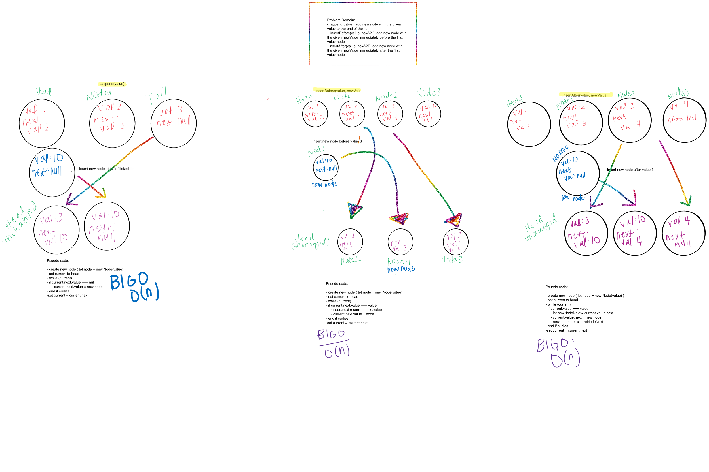

# Singly Linked Lists
Create a linked list, add values, check for values and return values.

## Challenge
Create a Node class
Create LinkedList class
Define method called insert: adds new node to the head of the list
Define method called includes: takes any value and returns boolean result depending on whether that value ecists within the list 
Define a method called toString: returns a string that lists linked list values (INCOMPLETE)

## Approach & Efficiency
- create Node class, require in LinkedList class
- require LinkedList in index 
- use index to invoke LinkedList class methods

## Solution

---------------------------------

# LL Insertions
Create methods that adds a new node to tail of linked list, inserts new node before specified value, inserts new node after specified value

## Challege
Define methods in LinkedList class:
- append (value)
- insertBefore(value, newValue)
- insertAfter(value, newValue)

## Approach & Efficiency
- O(n) for all methods

## Solution

-------------------------------------------------------
# LL NTH FROM END
Create a method takes in a value and returns the node that is that value-nth from the end. 

## Challenge
Define method: kthFromEnd(k)
-find length of list
-find target node (length - k + 1)
-return target node

## Approach & Efficiency
- O(n)

## Solution
