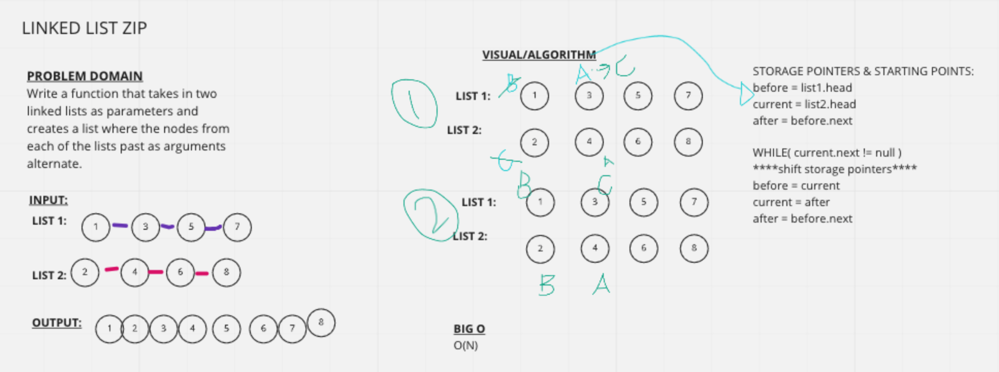

# Linked List Zip

## Challenge Description
Write a function that takes in two linked lists as arguments and zip the two lists together so that the nodes alternate between the two lists.

## Approach & Efficiency
These lists should be iterated thru using a while loop within a function that takes in each linked list as a parameter. 

First, you need to identify some good storage variable names, then identify where those will point to to start then create logic to shift those "pointers" as you go thru each linked list.

While you loop you thru and shift the storage pointer, you set before and current based on what info you have and then set after based on your newly set before.

I used variables: before, current and after.

## Solution

