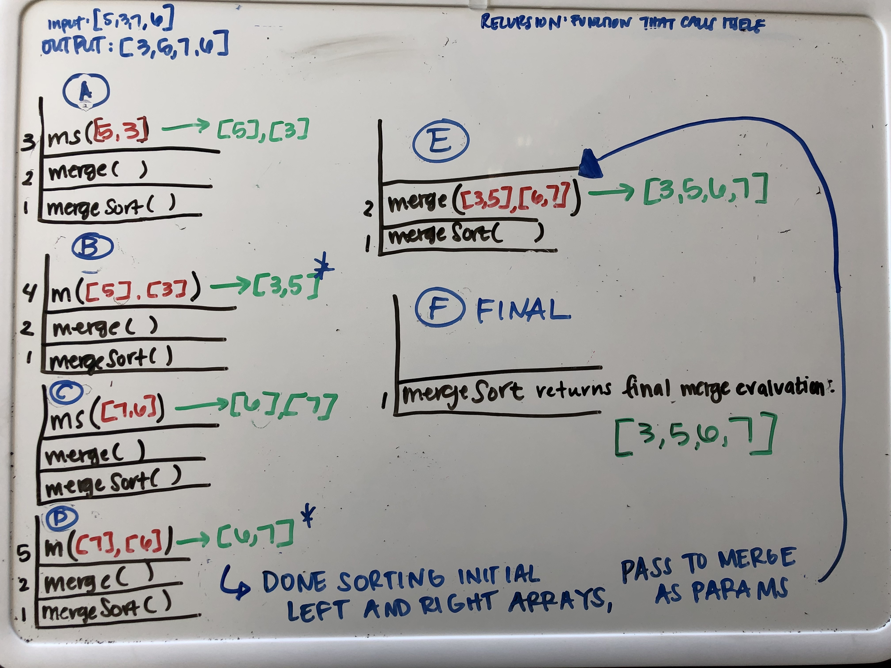

Merge sort is an array sorting method that relies on two functions and recursion.

The thought behind this algorithm is to break down the input array into in half, recursively using mergeSort() and then building what will be the output array back up thru the merge().

mergeSort() breaks down the input array into arrays of single values.  What is confusing abou this algorithm is that the recursive invocation of mergeSort happens within the invocation of merge(), which we do inside of mergeSort().

merge() builds up the eventually returned, sorted array.  It takes in the left and right single arrays and merges them so that the values go from smallest to largest.

The final call takes in the sorted version of the initial left and right arrays that mergeSort() divided in its first iteration and merges and returns those values into a single sorted array.

The merge() function does the heavy lifting in this algorithm but its return values are returned thru the line:
 `return merge(mergeSort(left), mergeSort(right))`.
 