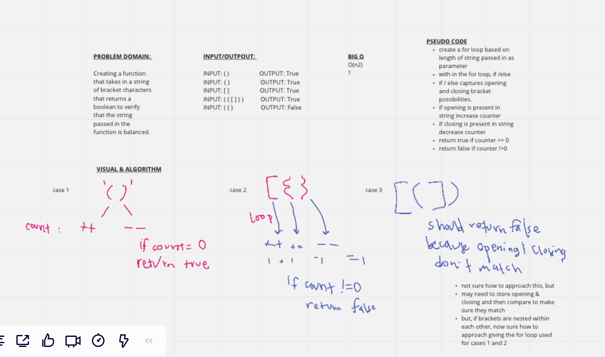

# Multi Bracket Validation
Authors: Dar-Ci Calhoun & Taylor Thornton

## Challenge Description
Write a function that takes in a string comprised of opening and closing hard, soft and curly brackets.  Our function should evaluate the string and return true if the brackets are balanced and false if the brackets are imbalanced.  

Imbalanced brackets can be a closing without an opening, or an opening without a closing. Or, closing and opening brackets that do not match.

## Approach & Efficiency
While perhaps not the most efficient, a for loop that is written that evaluates if/else conditional statements which increment or decrement a counter.  If the counter is = 0, return true and if the counter != 0 return false. 

## Solution

