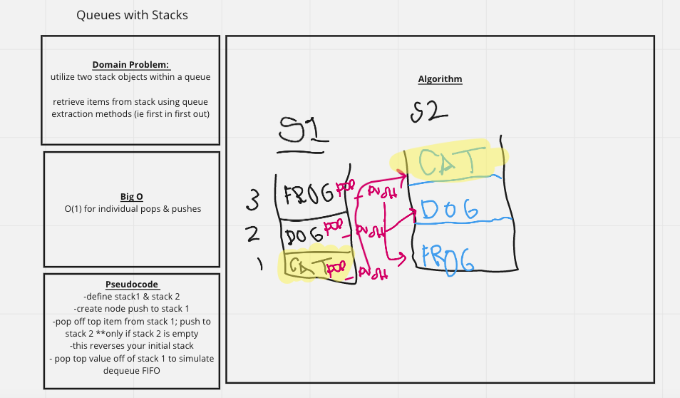

# Queues with Stacks
Queues are a FIFO data structure.  But, queues themselves can hold the stack data structure, which is LIFO.  The challenge here is to manipulate the data within the stack so that when a user makes a dequeue call the first item in the stack (which by its traditional stack nature would be last item out) is the item that is retrieved out of the queue structure. 

## Challenge Description
Create enqueu(value) method which inserts value into the psuedoqueue class, using a first in first out approach 

Create dequeue method which extracts value from the psuedoqueue using a first in first out approach.

## Approach & Efficiency
I believe that Big O for this process is O(n) to transfer items from stack 1 to stack 2 but O(1) for any enqueu or dequeu calls made.
- First item will be stored in stack, followed by next item on top etc. 
- We need to essentially reverse the stack so that the first item that was put in the stack (which is the value that an dequeu would expect to receive when called) is on the top of the stack. 
- So, we need to pop the top item in the stack, push to the empty stack and continue until stack 1 is empty. 
- Then, you can pop the the first item off of stack 2 which is what dequeue expects. 

## Solution

