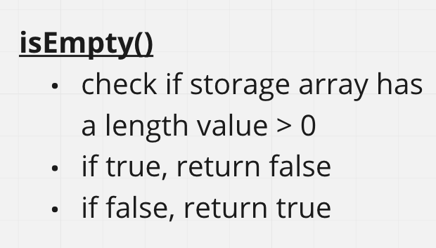

# Stacks and Queues
Stack Methods Given: push, pop, peek.

Queue Methods Given: enqueue, dequeue, peek

## Challege
For both Stack and Queue create a method:
isEmpty - returns true if stack is empty, returns false if stack is not empty

## Approach & Efficiency
Push: O(1)
Pop: O(1)
Peek: O(1)
isEmpty: O(1)
Enqueu: O(1)
Dequeue: O(1)

## Solution

