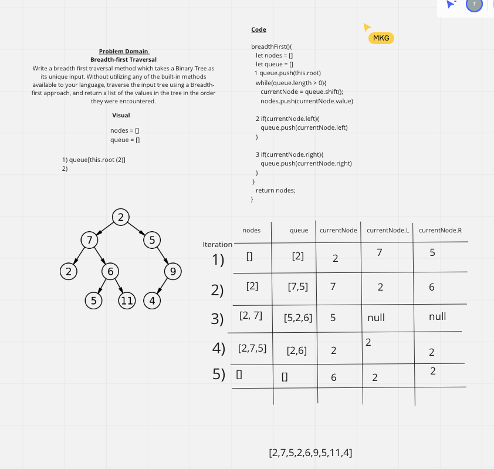

# Trees & Binary Search Trees

## Challenge
Create a breadthFirst() traversal method that takes a Binary Tree as its unique input. Traverse the input tree using a breadth-first approach and return a list of values in the tree in the order they were encountered. 

## Approach & Efficiency
- decleare two empty storage variables
- push nodes into queue
- dequeue (shift) from queue, store node.value in a current variable, 
- push that VALUE to the nodes array - ultimately returning nodes array with JUST values of nodes
- pushing the entire node to the dequeue allows us to access to the left and right properties of that particular node, which allows us to iterate thru the tree
- Big O: O(n) & O(h)

## Solution
BREADTH FIRST
