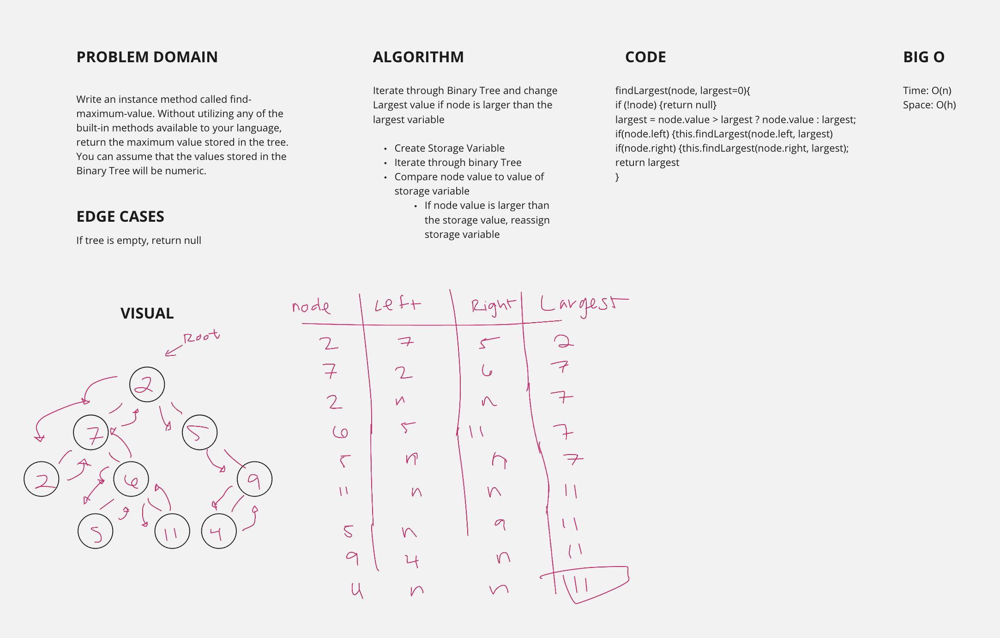

# Trees & Binary Search Trees

## Challenge
Create a maximum() method that traverses the Binary Tree and returns the largest value in the tree.

## Approach & Efficiency
- create a storage variable
- traverse the tree recursively: calling the function again with the .left and .right of the present current node value and reassign that value to your largest variable if it is in fact larger than the current.
- Big O: O(n)

## Solution
MAX METHOD (CODE CHALLENGE 16)
