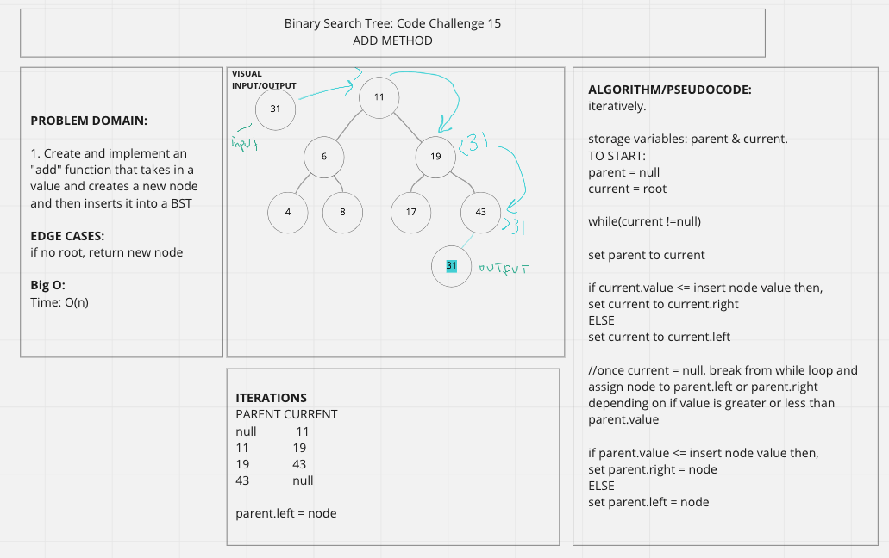
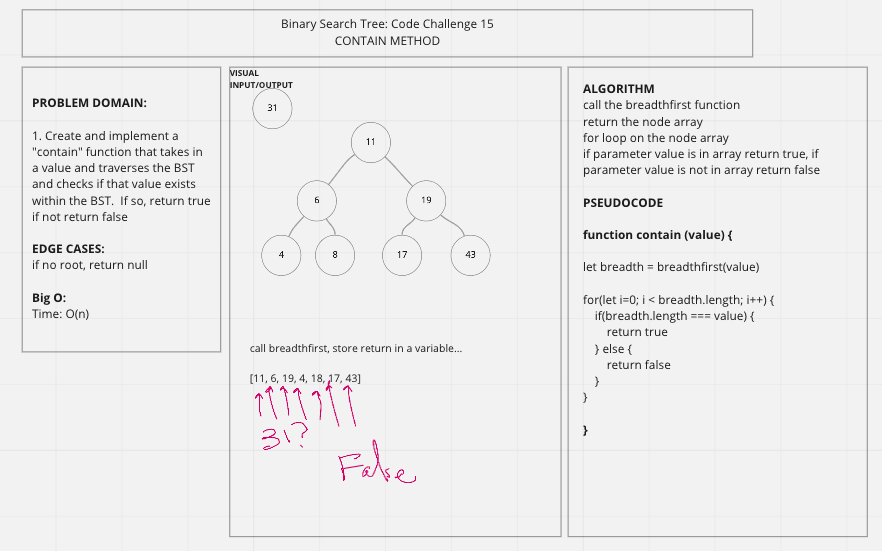

# Trees & Binary Search Trees
Methods Given: preOrder(), inOrder(), postOrder()

## Challege
Create an add() method in the BinaryTree class that takes in a value and adds the node in the appropriate place following BST structure 

Create a contain() method in the BinaryTree class that takes in a value and checks to see if that value exists in the BST.  If so, return true.  If not, return false.

Create a maximum() method that traverses the Binary Tree and returns the largest value in the tree.

## Approach & Efficiency
O(n)

## Solution
ADD METHOD (CODE CHALLENGE 15)

CONTAIN METHOD (CODE CHALLENGE 15)

MAX METHOD (CODE CHALLENGE 16)
